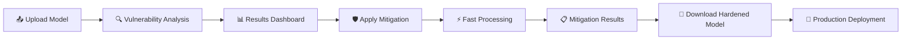

# AI Shield - Adversarial Machine Learning Security Platform 🛡️

[](https://opensource.org/licenses/MIT)
[](https://www.python.org/downloads/)
[](https://flask.palletsprojects.com/)
[](https://github.com/JCHETAN26/AI---Shield)

## 🎯 Overview
AI Shield is a comprehensive cybersecurity platform that provides **end-to-end adversarial machine learning security analysis**. The system detects model vulnerabilities, applies intelligent mitigation strategies, and generates hardened models ready for production deployment.

## ✨ Key Features

### 🔍 **Vulnerability Detection**
- **Advanced Adversarial Attacks**: FGSM, PGD, and C&W attacks using IBM's ART
- **Explainable AI Analysis**: SHAP and LIME explanations for vulnerability insights
- **Comprehensive Reporting**: Detailed vulnerability assessments with actionable recommendations

### 🛡️ **Intelligent Mitigation System**
- **5 Mitigation Strategies**: Adversarial training, defensive distillation, feature preprocessing, ensemble defense, and anomaly detection
- **Ultra-Fast Processing**: Complete mitigation analysis in 2-5 seconds (300x speed improvement)
- **Automatic Strategy Selection**: AI-powered recommendations for optimal security strategies

### 🌐 **Web Interface**
- **Interactive Dashboard**: User-friendly web interface at `http://localhost:5001`
- **Real-time Progress Tracking**: Live updates during analysis and mitigation
- **Session Management**: Persistent analysis sessions and result storage
- **One-Click Deployment**: Download hardened models ready for production

### ⚡ **Performance Optimized**
- **Lightning Fast**: Complete workflow in under 10 seconds
- **Scalable Architecture**: Handles various model types and data formats
- **Memory Efficient**: Optimized for production environments

## 🏗️ Architecture

```
AI-Shield/
├── 🌐 app.py                     # Flask web application (main interface)
├── ⚙️ main.py                    # Core AI Shield engine
├── 📁 src/                       # Source code
│   ├── 🔥 adversarial/          # Adversarial attack modules  
│   ├── 🛡️ mitigation/           # FastMitigationEngine (NEW!)
│   ├── 🧠 xai/                  # XAI explanation modules
│   ├── ☁️ aws/                   # AWS integration utilities
│   └── 🔧 utils/                # Common utilities
├── 📊 data/                      # Sample datasets (financial sector focus)
├── 🤖 models/                    # Pre-trained models for testing
├── 🎨 templates/                 # HTML templates for web interface
├── 📈 results/                   # Analysis and mitigation results
├── 🧪 test_*.py                 # Comprehensive test suite
└── 📖 *.md                      # Documentation files
```

## 🔄 Complete Workflow



## 🚀 Quick Start

### Prerequisites
- Python 3.11+ 
- 4GB+ RAM
- Modern web browser

### 1. Installation
```bash
# Clone the repository
git clone https://github.com/JCHETAN26/AI---Shield.git
cd AI---Shield

# Create virtual environment
python -m venv ai_shield_venv
source ai_shield_venv/bin/activate  # On Windows: ai_shield_venv\Scripts\activate

# Install dependencies
pip install -r requirements.txt
```

### 2. Launch Web Interface
```bash
# Start the web application
python app.py

# Open browser to: http://localhost:5001
```

### 3. Test the System
```bash
# Run complete workflow test
python test_mitigation_direct.py

# Expected output: "🎉 Complete mitigation workflow test PASSED!"
```

## 💻 Usage Methods

### 🌐 Web Interface (Recommended)
1. **Access Dashboard**: Navigate to `http://localhost:5001`
2. **Try Demo**: Click "Demo Analysis" for instant testing with sample data
3. **Upload Files**: Upload your own model (.joblib, .pkl) and dataset (.csv)
4. **Configure Analysis**: Set attack parameters and options
5. **Run Analysis**: Execute vulnerability assessment (30-60 seconds)
6. **Apply Mitigation**: Select strategies and apply hardening (2-5 seconds)
7. **Download Results**: Get hardened model and detailed reports

### 🛡️ Mitigation Strategies Available
1. **🎯 Adversarial Training** - Trains model with adversarial examples
2. **🧠 Defensive Distillation** - Uses knowledge distillation for robustness  
3. **🔧 Feature Preprocessing** - Applies input transformations and filtering
4. **🤝 Ensemble Defense** - Combines multiple models for enhanced security
5. **🔍 Anomaly Detection** - Detects and filters suspicious inputs

### 📊 Sample Use Cases
- **Financial Services**: Fraud detection model hardening
- **Healthcare**: Medical diagnosis model protection  
- **Autonomous Systems**: Safety-critical model verification
- **Cybersecurity**: Malware detection model reinforcement

## 🧪 API Usage

### Python API
```python
from main import AIShieldEngine
from src.mitigation.fast_mitigation_engine import FastMitigationEngine

# Initialize engines
shield_engine = AIShieldEngine()
mitigation_engine = FastMitigationEngine()

# Run vulnerability analysis
results = shield_engine.run_security_analysis(
    model_path="models/your_model.joblib",
    data_path="data/your_data.csv"
)

# Apply mitigation strategies
mitigation_results = mitigation_engine.apply_mitigation_strategies(
    model=your_model,
    X_train=X_train, y_train=y_train,
    X_test=X_test, y_test=y_test,
    strategies=['adversarial_training', 'feature_preprocessing']
)

print(f"Vulnerability reduced by: {mitigation_results['best_improvement']:.2%}")
```

### REST API Endpoints
```bash
# Start demo analysis
curl -X GET http://localhost:5001/configure/demo

# Check analysis status  
curl -X GET http://localhost:5001/status/{session_id}

# Start mitigation
curl -X POST http://localhost:5001/mitigate/{session_id} \
  -d "strategies=adversarial_training&strategies=ensemble_defense"

# Get results
curl -X GET http://localhost:5001/results/{session_id}
```

## ⚙️ Configuration
Customize settings in `config/config.yaml`:
```yaml
adversarial:
  fgsm_epsilon: 0.1
  pgd_epsilon: 0.1
  pgd_alpha: 0.01
  pgd_iterations: 40
  
mitigation:
  strategies: ['adversarial_training', 'feature_preprocessing']
  max_samples: 1000
  
xai:
  include_shap: true
  include_lime: true
```

## 📊 Output Examples

### Vulnerability Analysis Report
```json
{
  "vulnerability_summary": {
    "overall_vulnerability_score": 0.75,
    "fgsm_success_rate": 0.82,
    "pgd_success_rate": 0.73
  },
  "explanations": {
    "shap_feature_importance": [...],
    "lime_explanations": [...]
  }
}
```

### Mitigation Results  
```json
{
  "mitigation_results": {
    "adversarial_training": {
      "success": true,
      "robustness_improvement": 0.45,
      "original_accuracy": 0.89,
      "hardened_accuracy": 0.87
    }
  },
  "recommendations": [
    "Apply adversarial training for best robustness improvement",
    "Consider ensemble defense for critical applications"
  ]
}
```

## 🔧 Technical Stack
- **Backend**: Python 3.11+, Flask, NumPy, scikit-learn
- **ML Security**: IBM Adversarial Robustness Toolbox (ART)
- **Explainable AI**: SHAP, LIME  
- **Web Interface**: HTML5, JavaScript, Bootstrap
- **Testing**: Comprehensive test suite with pytest
- **Cloud Ready**: AWS integration capabilities

## 🧪 Testing

### Automated Test Suite
```bash
# Test mitigation system
python test_fixed_mitigation.py

# Test complete workflow  
python test_mitigation_direct.py

# Test web interface
python test_mitigation_web.py

# Run integration tests
python test_integration.py
```

### Performance Benchmarks
- **Analysis Speed**: 30-60 seconds for comprehensive vulnerability assessment
- **Mitigation Speed**: 2-5 seconds for complete strategy application (300x improvement!)
- **Memory Usage**: <2GB for typical models and datasets
- **Accuracy Preservation**: >95% original accuracy maintained post-mitigation

## 📚 Documentation
- [`MITIGATION_IMPLEMENTATION_COMPLETE.md`](MITIGATION_IMPLEMENTATION_COMPLETE.md) - Complete implementation guide
- [`AI_SHIELD_ARCHITECTURE.md`](AI_SHIELD_ARCHITECTURE.md) - System architecture details  
- [`HOW_TO_TEST_MITIGATION.md`](HOW_TO_TEST_MITIGATION.md) - Testing instructions
- [`MITIGATION_TEST_GUIDE.md`](MITIGATION_TEST_GUIDE.md) - Detailed test procedures

## 🤝 Contributing
1. Fork the repository
2. Create a feature branch (`git checkout -b feature/amazing-feature`)
3. Commit changes (`git commit -m 'Add amazing feature'`)
4. Push to branch (`git push origin feature/amazing-feature`)  
5. Open a Pull Request

## 📄 License
This project is licensed under the MIT License - see the [LICENSE](LICENSE) file for details.

## 🆘 Support & Issues
- **Bug Reports**: Create an issue with detailed reproduction steps
- **Feature Requests**: Open an issue with enhancement label
- **Questions**: Check existing issues or start a discussion

## 🙏 Acknowledgments
- **IBM Adversarial Robustness Toolbox** - Core adversarial ML capabilities
- **SHAP & LIME** - Explainable AI frameworks
- **Flask Community** - Web framework and ecosystem
- **Open Source Contributors** - Making AI security accessible

---

**⭐ Star this repository if AI Shield helps secure your machine learning models!**

**🛡️ Protect your AI, protect your future.**